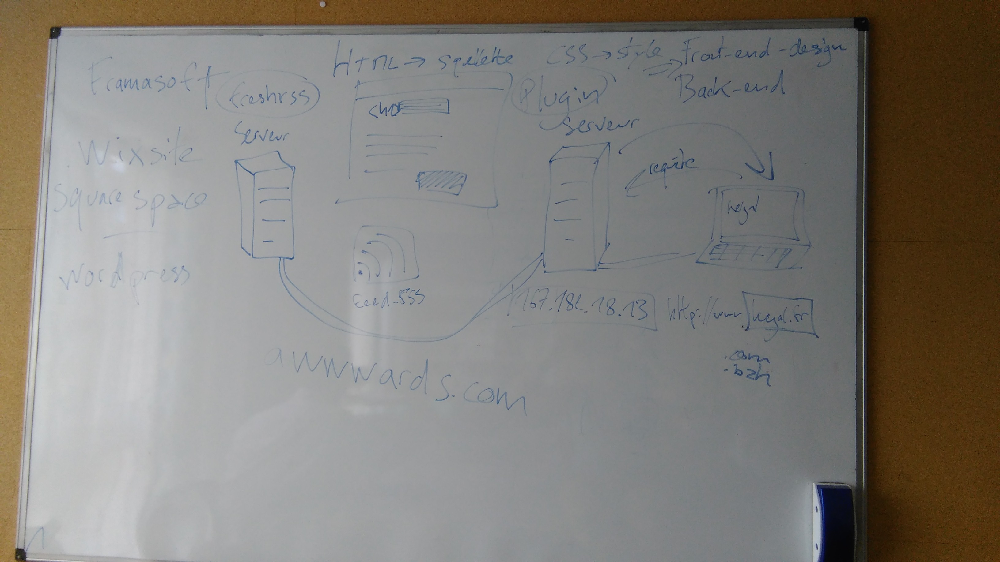

# Je veux un site web ! - Programme

*Programme en cours de construction*

## Principe

- privilégier vos questions, retours. C'est aussi vous qui allez influer le cours de l'atelier. Si le "programme" est pas tenu, c'est pas grave. Je reste là cet aprem pour ceux qui veulent, et je mets à dispo prises de note pour ceux qui ne peuvent rester.

- je ne connais pas tout et je suis là aussi pour apprendre, avec vous et de vous. Si vous-mêmes vous avez testé / entendu parler de solutions ou outils, n'hésitez pas à prendre la parole. On est sur de l'échange de savoir, pas sur un cours pompeux descendant.

## Points à aborder

**~9h30**

### Tour de table

- quelle est votre activité ?
- vous avez déjà un site ? Ou une idée de comment vous allez vous y prendre ?

- Grégoire : vrai faux geek, projet autour du jeu / éducation à l'environnement. Utilise tout le temps l'ordi mais techniquement... pas à l'aise avec blog, wordpress... calamiteux. Branché logiciel libre. Je veux un site web en libre.
- Cathy : kreops 18-19, atelier partagé pour former à la couture, valoriser métier manuel, sensibilisé recyclage.Comment je commence toute seule ? Besoin de donnre une image de son métier, modéliste. Avait déjà créé un blog en 2005 pour une asso de dessin. Quand je suis accompagnée ça se passe bien. Il me faut un lexique. 
  - Blog : bien ou pas bien ?
  - Site internet : trop tôt ?
  - facebook ça se passe bien
- Amelie : kreops 18-19, photgraphe graphiste. Site sous wix. Peut-être formation de webdesign l'an prochain. Autodidacte.Wix : plus graphique que wordpress, plus léger à utiliser. Je trouve wordpress un peu limité. Un peu de CM sur les réseaux pour une asso, un artiste.
- Edith : kreops 18-19, bistrot boutique produit du territoire. J'ai jamais créé de site internet, pas de pb avec l'informatique (jétais dans le systeme autoroutier). Je veux un site internet, car fb pas assez. Site ou changer le menu tous les jours. Aller sur instagram, snapchat pour choper les jeunes.(menu : comme sur site deci-delà)
- Christelle, lieu de ressource materiau de recup et promotion pour artisans d'art. Pas à l'aise avec l'informatique, les réseaux sociaux.
- Jean-François, formation commercial puis educateur sportif., puis grossiste alimentaire... Veut retourner dans l'alimentaire avec bio et local. Reve d'une plateforme qui mette en valeur les initiatives alimentaires Dinan-St Malo. En pleine révolution numérique. L'idéologie derrière m'inspire beaucoup de réflexion mais l'outil est intéressant. 
- Stéphanie, projet aménagement terrain habitat léger. Site web pas encore. 

-> automatisation réseaux sociaux

### Anatomie d'un site internet

- c'est composé de quoi ? 
  - Serveur, BDD, NDD
  - html, css, javascript, front/back, php, python, ruby...
  - C++

- internet, c'est des câbles dans l'océan
- schéma avec serveur / client
- expliquer le chemin d'une requête
- hébergement BDD / serveur web 
- le cloud

- nom de domaine et extensions, et adresses IP

- HTML = squelette 

- thème = fringues

### Les différentes typologies de site web, du plus simple au plus complexe
- interface admin ? comptes utilisateurs ? composantes dynamiques (SPA) ?
- cf how much cost
- y'a plusieurs site pour créer ?

Comment connaitre la réputation d'un nom de domaine ?

Avoir des liens de fournisseurs "éthique", qui sont les acteurs recommendables ?

gozmail !

### Ce à quoi il faut penser

- rédactionnel prend du temps
- images
- animation et gestion de communauté
- gérer les vidéos : héberger sur plateforme (youtube, peertube...), penser aux sous-titres
- rgpd

### Prestataire en régie / au forfait / méthodes agiles

Cahier des charges ou pas ?

### Délais / coût / fiabilité -> inconciliable

### Ethique et responsabilité

- plateforme privée / open source
- ouvrir son code et ses données
- hébergement vert / européen

## Besoins
- paper board ou tableau blanc
- video proj
- code wifi à partager

## Sujets abordés dans la matinée 

- framasoft
- wixsite / squarespace
- wordpress
- lecteurs de flux rss (freshrss)
- internet, c'est des câbles sous la mer
- awwwards.com
- html et css
- tags
- plugins
- requêtes et serveurs
- front-end et back-end
- noms de domaine, extensions, adresses IP
- le cloud
- combien ça coûte

## Ressources et inspirations pour moi

- Les questions des coopanamiens pour la journée numérique de Numéricoop du 19/03/19 : https://annuel.framapad.org/p/Numericoop19mars_propositionsdesujets

-De quoi est constitué un site internet ? Ses différents composants
- quels logiciels libres pour mon activités
- créer son site Internet, avec qui ? comment ? Quel hébergeur ?
-Site vitrine quel coût ? 
-Comment bien choisir son modèle/template? 
-Comment augmenter significativement le trafic et remonter dans les premiers résultats sur Google ?
-Comment optimiser sa communication sur les réseaux sociaux sans être un pro du community management ?
- quel réseau social utiliser pour communiquer sur mon activité, mes produits
- quelles alternatives à WordPress?
- Comment mettre en avant une vidéo sur WordPress ?

## Ressources pour les participants

# Après-midi libre

